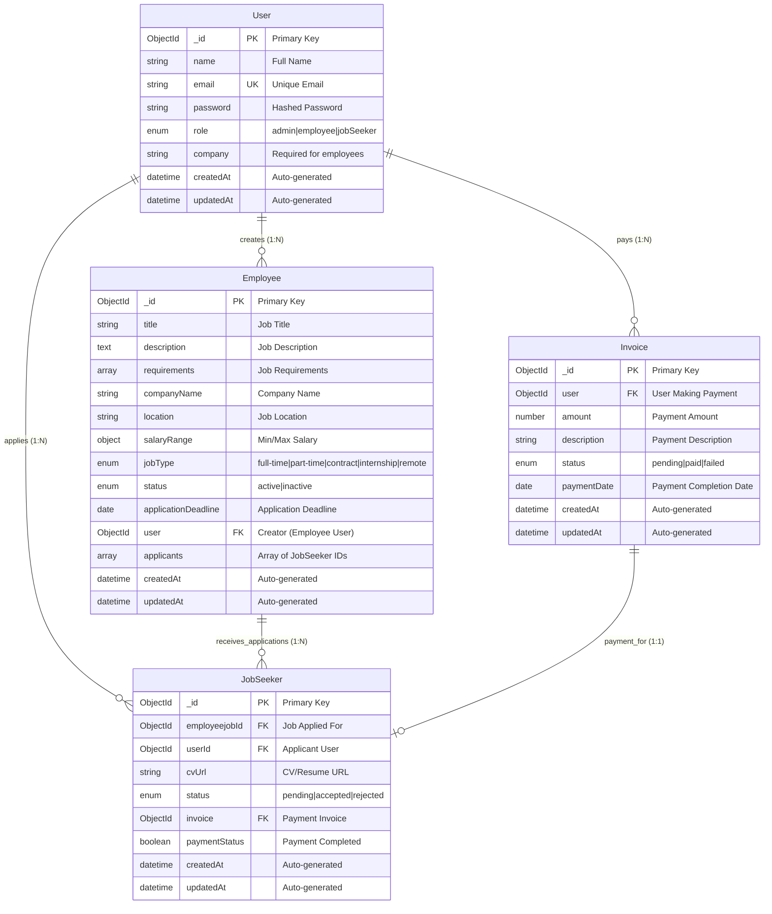

# Visual ERD - Job Portal Database Schema

## Relationship Details

### User → Employee (One-to-Many)

- **Description:** One employee user can create multiple job postings
- **Foreign Key:** `Employee.user` references `User._id`
- **Business Rule:** Only users with role "employee" can create job postings

### User → JobSeeker (One-to-Many)

- **Description:** One job seeker user can submit multiple job applications
- **Foreign Key:** `JobSeeker.userId` references `User._id`
- **Business Rule:** Only users with role "jobSeeker" can apply for jobs

### User → Invoice (One-to-Many)

- **Description:** One user can have multiple payment invoices
- **Foreign Key:** `Invoice.user` references `User._id`
- **Business Rule:** Invoices track payments for premium features

### Employee → JobSeeker (One-to-Many)

- **Description:** One job posting can receive multiple applications
- **Foreign Key:** `JobSeeker.employeejobId` references `Employee._id`
- **Additional:** `Employee.applicants` array also tracks this relationship

### Invoice → JobSeeker (One-to-One, Optional)

- **Description:** One invoice can be associated with one job application
- **Foreign Key:** `JobSeeker.invoice` references `Invoice._id`
- **Business Rule:** Optional payment for premium application features
